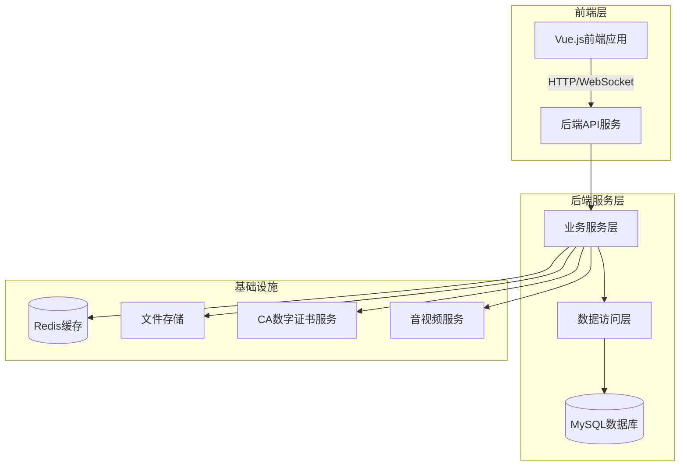

# 电子招投标平台

## 📋 项目简介

电子招投标平台是一个功能完整、技术先进的**全流程电子化招标采购系统**，实现了从采购计划发起到中标通知书签发的完整招标采购流程。系统支持**采购人、代理机构、供应商、评审专家**四个核心角色协同工作，确保招标采购过程的**公开、公平、公正**。

### 核心价值
- ✅ **全程线上化**：从采购计划到合同签署，全流程数字化管理
- ✅ **多角色协同**：支持采购人、代理机构、供应商、评审专家四类角色
- ✅ **远程开评标**：支持现场、远程、混合三种开评标方式
- ✅ **智能评审**：9个评审阶段，支持资格审查、符合性审查、综合评分等
- ✅ **数字签名**：集成CA数字证书，支持电子签名和报告签署
- ✅ **规范合规**：符合国家招投标法律法规要求

### 适用场景

- 政府采购平台
- 企业采购平台
- 工程建设项目招投标
- 货物和服务采购
- 各类招标代理机构

---

## 🎯 核心功能模块

### 1. 采购人（采购单位）

招标采购活动的发起方和需求方，主要功能包括：

- **采购计划管理**：创建、编辑、审核采购计划
- **委托协议签署**：委托代理机构执行采购项目
- **采购文件确认**：确认代理机构编制的采购文件
- **采购结果确认**：确认评审结果和中标人
- **项目档案查看**：查看项目全流程档案和文档

### 2. 代理机构

招标采购活动的核心执行者，受采购单位委托负责项目全流程执行：

- **计划受理**：受理采购单位的委托任务
- **项目管理**：创建和管理招标项目，支持多分包项目
- **公告发布**：发布招标公告、更正公告、中标公告等
- **开标组织**：组织现场/远程开标，管理开标流程
- **评审管理**：分配评审专家，组织评审活动
- **结果发布**：发布评审结果和中标公示
- **报名审核**：审核供应商报名资格

### 3. 供应商/投标人

招标采购活动的参与竞争方：

- **项目发现**：浏览和搜索招标项目
- **项目报名**：在线报名参与投标
- **投标文件管理**：上传和管理投标文件
- **远程开标参与**：参与远程开标，在线签到、唱标、签署
- **远程评标参与**：参与远程评标答疑
- **中标通知书接收**：接收和确认中标通知书

### 4. 评审专家

独立第三方专业评审人员，负责对投标文件进行专业评审：

- **身份认证**：专家身份认证和登录
- **评审组织**：评审组长组织评审流程
- **专业评审**：9个评审阶段完整评审流程
  - 采购文件确认
  - 资格审查
  - 符合性审查
  - 同品牌处理
  - 综合评分
  - 中小企业优惠
  - 复核确认
  - 候选人推荐
  - 报告签署
- **文件分析**：在线查看和分析投标文件
- **报告签署**：数字签名签署评审报告
- **会商主持**：评审组长主持专家会商

---

## 🏗️ 技术架构

### 系统架构

系统采用**前后端分离**架构，后端提供RESTful API，前端通过HTTP/WebSocket与后端通信。



### 技术栈

#### 后端技术栈

- **框架**：Spring Boot 2.6.13
- **语言**：Java 1.8
- **数据**：MyBatis 
- **数据库**：MySQL 5.7+
- **缓存**：Redis
- **消息队列**：Spring Message Center
- **文档工具**：Swagger 3.0.0
- **工具库**：Hutool 5.8.8、Lombok
- **PDF处理**：OpenPDF 1.3.30、Apache POI 4.1.2
- **数字签名**：TSign SDK 2.1.0

#### 前端技术栈

- **框架**：Vue.js 2.6.11
- **UI组件库**：Element UI 2.15.2
- **状态管理**：Vuex 3.1.3
- **路由**：Vue Router 3.1.6
- **HTTP客户端**：Axios 0.18.0
- **工具库**：Lodash 4.17.20、Moment.js 2.27.0
- **图表**：ECharts 5.1.2
- **PDF预览**：vue-pdf 4.3.0
- **音视频**：@volcengine/rtc 4.67.8
- **富文本编辑器**：TinyMCE 4.0.0

### 数据库设计

系统包含**30+核心业务表**，涵盖完整的招投标业务流程：

#### 核心业务表

- **采购计划相关**：`procurement_plan`、`procurement_plan_item`、`delegation_task`
- **招标项目相关**：`bidding_project`、`bidding_package`、`project_announcement`、`project_evaluation_criteria`
- **供应商参与相关**：`project_registration`、`supplier_bidding_document`、`project_fee`
- **开标评标相关**：`opening_session`、`opening_supplier`、`evaluation_session`、`project_expert`、`project_expert_evaluation`
- **报告和文档相关**：`document_template`、`project_evaluation_report`
- **基础数据表**：`company`、`biz_file`、`biz_operation_log`

详细的数据库设计文档请参考：`docs/现有数据库/bidding.sql`

---

## 📁 代码框架说明

### 项目结构

项目采用**多模块Maven项目**结构，按职责清晰划分模块：

```
BZ_GC/
├── bidding/                          # 招投标核心模块
│   ├── bidding-service/              # 业务服务层
│   │   ├── entity/                   # 实体类（52个实体）
│   │   ├── mapper/                   # 数据访问层（20+ Mapper）
│   │   ├── service/                  # 业务服务层（60+ Service）
│   │   └── common/                   # 公共组件
│   ├── bidding-app-api/              # 应用API层
│   │   └── controllers/              # RESTful控制器
│   └── bidding-api/                  # API接口定义
├── portal/                           # 前端Vue应用
│   └── src/
│       └── bidding/                  # 招投标前端模块
│           ├── api/                  # API接口层（20+ Service）
│           ├── views/                # 视图页面
│           │   ├── agency/           # 代理机构视图
│           │   ├── purchaser/        # 采购人视图
│           │   ├── supplier/         # 供应商视图
│           │   └── expert/           # 评审专家视图
│           ├── components/           # 组件库
│           └── utils/                # 工具类
├── framework/                        # 框架基础模块
│   ├── framework/                    # 核心框架
│   ├── service/                      # 基础服务
│   ├── web/                          # Web框架
│   └── datacenter/                   # 数据中心
└── docs/                             # 项目文档
    └── 现有数据库/                   # 数据库设计文档
```

### 模块职责划分

#### 1. bidding-service（业务服务层）

**职责**：核心业务逻辑实现

- **entity/**：实体类定义，对应数据库表结构
- **mapper/**：MyBatis数据访问接口和XML映射文件
- **service/**：业务服务类，实现核心业务逻辑
  - `BiddingProjectService`：项目管理服务
  - `ProjectAnnouncementService`：公告管理服务
  - `ProjectExpertEvaluationService`：专家评审服务
  - `OpeningSessionService`：开标会话服务
  - `EvaluationSessionService`：评标会话服务
  - 等60+业务服务类

**特点**：
- 统一的`BaseService`基类，提供通用方法
- 完善的异常处理机制
- 数据校验和业务规则验证
- 操作日志记录

#### 2. bidding-app-api（应用API层）

**职责**：RESTful API接口实现

- **controllers/**：控制器类，处理HTTP请求
  - 继承`AppBaseController`基类
  - 统一的权限控制（`@PermissionKeys`）
  - 数据权限隔离（按企业ID、角色类型）
  - 统一的响应格式

**特点**：
- 支持多角色权限判断（采购人、供应商、代理机构、专家）
- 统一的数据权限控制
- Swagger API文档自动生成
- 统一的异常处理和响应格式

#### 3. portal（前端应用）

**职责**：用户界面和交互

**目录结构**：
```
portal/src/bidding/
├── api/                    # API接口层
│   ├── BiddingProjectService.js
│   ├── ProjectExpertEvaluationService.js
│   └── ...                 # 20+ API服务
├── views/                  # 视图页面
│   ├── agency/             # 代理机构功能页面
│   ├── purchaser/          # 采购人功能页面
│   ├── supplier/           # 供应商功能页面
│   └── expert/             # 评审专家功能页面
│       └── evaluation/     # 专家评审模块（9个评审阶段）
├── components/             # 组件库
│   └── VideoMeeting/       # 音视频会议组件
├── utils/                  # 工具类
│   ├── errorHandler.js     # 错误处理
│   ├── rtcService.js       # 音视频服务
│   └── evaluationWebSocketService.js  # WebSocket服务
└── constants/              # 常量定义
    └── evaluationStatus.js # 评审状态常量
```

**特点**：
- 组件化开发，代码复用率高
- Vuex集中状态管理
- 统一的API请求封装（`ServiceClient`）
- 完善的错误处理和用户提示
- 响应式设计，支持PC和移动端

### 代码规范

#### 后端代码规范

1. **命名规范**
   - 实体类：`XxxInfo`（如：`BiddingProjectInfo`）
   - 控制器：`XxxController`（如：`BiddingProjectController`）
   - 服务类：`XxxService`（如：`BiddingProjectService`）
   - Mapper：`XxxMapper`（如：`BiddingProjectMapper`）
   - 模型类：`XxxModel`（如：`BiddingProjectModel`）

2. **分层架构**
   - Controller层：负责数据接收和校验，调用Service层
   - Service层：实现业务逻辑，调用Mapper层
   - Mapper层：数据访问，使用MyBatis

3. **数据权限控制**
   - 在Controller中通过`getCompanyId()`获取企业ID
   - 使用`isPurchaser()`、`isSupplier()`、`isAgency()`、`isExpert()`判断角色
   - 查询和操作时自动过滤数据权限

4. **异常处理**
   - 业务异常使用`BusinessException`
   - 统一异常处理和错误响应

#### 前端代码规范

1. **目录结构**
   - `api/`：API接口层
   - `components/`：组件库
   - `utils/`：工具类
   - `views/`：视图页面（按角色组织）

2. **组件规范**
   - 文件命名：PascalCase.vue
   - Props完整定义：类型、默认值、必需性
   - 事件命名：`handle`前缀

3. **API调用**
   - 统一使用`ServiceClient`（`@/utils/webrequest`）
   - 统一错误处理和提示
   - 统一数据格式：`{ success: true, data: {...}, message: '操作成功' }`

4. **状态管理**
   - 使用Vuex管理共享状态
   - 禁止在组件中直接计算应该由Vuex管理的状态
   - 通过actions更新状态，禁止直接修改state

### 核心设计模式

1. **分层架构模式**：Controller → Service → Mapper
2. **依赖注入**：Spring IoC容器管理Bean
3. **模板方法模式**：`BaseService`提供通用方法
4. **策略模式**：不同角色使用不同的业务策略
5. **观察者模式**：WebSocket实时通知
6. **工厂模式**：文档模板生成

---

## 🚀 快速开始

### 环境要求

- **JDK**：1.8+
- **Maven**：3.6+
- **Node.js**：12+
- **MySQL**：5.7+
- **Redis**：5.0+

### 安装步骤

#### 1. 克隆项目

```bash
git clone <repository-url>
cd BZ_GC
```

#### 2. 数据库初始化

```bash
# 导入数据库脚本
mysql -u root -p < docs/现有数据库/bidding.sql
```

#### 3. 后端配置

编辑配置文件：`bidding/bidding-app-api/src/main/resources/application.yml`

```yaml
spring:
  datasource:
    url: jdbc:mysql://localhost:3306/bidding?useUnicode=true&characterEncoding=utf8
    username: root
    password: your_password
  redis:
    host: localhost
    port: 6379
```

#### 4. 编译后端

```bash
# 在项目根目录执行
mvn clean install -DskipTests
```

#### 5. 启动后端服务

```bash
cd bidding/bidding-app-api
mvn spring-boot:run
```

后端服务默认运行在：`http://localhost:8080`

#### 6. 前端配置

编辑配置文件：`portal/src/config/dev.env.js`

```javascript
module.exports = {
  BASE_API: '"http://localhost:8080"'
}
```

#### 7. 安装前端依赖

```bash
cd portal
npm install
```

#### 8. 启动前端服务

```bash
npm run serve
```

前端服务默认运行在：`http://localhost:9528`

### 访问系统

- 前端地址：http://localhost:9528
- API文档：http://localhost:8080/swagger-ui.html

---

## ✨ 项目特色

### 1. 完整的业务流程

覆盖招标采购全流程：
- 采购计划 → 项目创建 → 公告发布 → 供应商报名 → 投标文件提交 → 开标 → 评标 → 结果公示 → 合同签署

### 2. 多角色协同

支持四类角色协同工作，每个角色有独立的权限和功能：
- 采购人：采购计划管理和结果确认
- 代理机构：项目全流程执行
- 供应商：投标参与和文件管理
- 评审专家：专业评审和报告签署

### 3. 远程开评标

支持三种开评标方式：
- **现场开评标**：传统现场方式
- **远程开评标**：完全线上化
- **混合开评标**：现场+远程结合

集成音视频服务，支持实时音视频通信。

### 4. 智能评审系统

9个评审阶段，支持：
- 资格审查和符合性审查
- 同品牌产品处理
- 综合评分和最低评标价法
- 中小企业优惠政策
- 二次报价（竞争性谈判）
- 评审报告自动生成和数字签名

### 5. 数字签名集成

- 集成CA数字证书服务
- 支持电子签名和报告签署
- 签署记录完整保存
- 符合电子签名法要求

### 6. 完善的文档管理

- 文档模板管理
- 文档版本控制
- 文档在线预览
- 文档下载和归档

---

## 🔧 技术亮点

1. **前后端分离架构**：清晰的职责划分，便于开发和维护
2. **多模块Maven项目**：模块化设计，代码组织清晰
3. **统一的基础框架**：`bluestone-framework`提供通用能力
4. **完善的权限控制**：数据权限和功能权限双重控制
5. **实时通信**：WebSocket支持实时消息推送
6. **音视频集成**：支持远程开评标音视频通信
7. **PDF处理能力**：支持PDF生成、预览、转换
8. **操作日志**：完整的操作日志记录，便于审计
9. **代码规范**：统一的代码规范和最佳实践
10. **可扩展性**：良好的架构设计，便于功能扩展

---

## 📞 联系方式

如有任何问题或需要技术支持，请联系：

- **技术支持**：767086416@qq.com
- **商业合作**：767086416@qq.com
- **微信联系**：微信号：wzhnbb


---


**注意**：本项目为商业项目，购买后提供完整源代码和技术支持。请勿用于非法用途。
