# 🏆 电子招投标平台 - 全流程电子化招标采购系统

> **功能完整、开箱即用的企业级招投标解决方案**

电子招投标平台是一个**功能完整、技术先进的全流程电子化招标采购系统**，实现了从采购计划发起到中标通知书签发的完整招标采购流程。系统支持**采购人、代理机构、供应商、评审专家**四个核心角色协同工作，确保招标采购过程的**公开、公平、公正**。

## 💎 核心价值主张

- ✅ **全程线上化**：从采购计划到合同签署，全流程数字化管理，告别纸质文件
- ✅ **多角色协同**：支持采购人、代理机构、供应商、评审专家四类角色无缝协作
- ✅ **远程开评标**：支持现场、远程、混合三种开评标方式，打破地域限制
- ✅ **智能评审**：9个评审阶段完整流程，支持资格审查、符合性审查、综合评分等
- ✅ **数字签名**：集成CA数字证书，支持电子签名和报告签署，具有法律效力
- ✅ **规范合规**：符合国家招投标法律法规要求，确保流程合规性

## 🎯 适用场景

- **政府采购平台**：各级政府机构采购管理
- **企业采购平台**：大型企业集团采购管理
- **工程建设项目招投标**：工程建设类项目招投标
- **货物和服务采购**：各类货物和服务采购
- **招标代理机构**：专业招标代理机构业务管理

---

## 🎯 核心功能模块

### 1. 采购人（采购单位）

招标采购活动的发起方和需求方，主要功能包括：

- **采购计划管理**：创建、编辑、审核采购计划
- **委托协议签署**：委托代理机构执行采购项目
- **采购文件确认**：确认代理机构编制的采购文件
- **采购结果确认**：确认评审结果和中标人
- **项目档案查看**：查看项目全流程档案和文档

### 2. 代理机构

招标采购活动的核心执行者，受采购单位委托负责项目全流程执行：

- **计划受理**：受理采购单位的委托任务
- **项目管理**：创建和管理招标项目，支持多分包项目
- **公告发布**：发布招标公告、更正公告、中标公告等
- **开标组织**：组织现场/远程开标，管理开标流程
- **评审管理**：分配评审专家，组织评审活动
- **结果发布**：发布评审结果和中标公示
- **报名审核**：审核供应商报名资格

### 3. 供应商/投标人

招标采购活动的参与竞争方：

- **项目发现**：浏览和搜索招标项目
- **项目报名**：在线报名参与投标
- **投标文件管理**：上传和管理投标文件
- **远程开标参与**：参与远程开标，在线签到、唱标、签署
- **远程评标参与**：参与远程评标答疑
- **中标通知书接收**：接收和确认中标通知书

### 4. 评审专家

独立第三方专业评审人员，负责对投标文件进行专业评审：

- **身份认证**：专家身份认证和登录
- **评审组织**：评审组长组织评审流程
- **专业评审**：9个评审阶段完整评审流程
  - 采购文件确认
  - 资格审查
  - 符合性审查
  - 同品牌处理
  - 综合评分
  - 中小企业优惠
  - 复核确认
  - 候选人推荐
  - 报告签署
- **文件分析**：在线查看和分析投标文件
- **报告签署**：数字签名签署评审报告
- **会商主持**：评审组长主持专家会商

---

## 🌟 十大核心亮点

### 1. 在线发布与报名
- **快速发布**：5分钟完成公告发布，无需线下宣传
- **覆盖面广**：触达更多潜在供应商，提升竞争度
- **降低成本**：无需纸质文件，大幅降低宣传成本

### 2. 文件加密上传
- **安全保障**：投标文件加密上传，确保文件安全
- **防泄露**：开标前文件完全加密，无法查看
- **合规性**：符合招投标保密要求

### 3. 远程/混合开标
- **灵活高效**：支持现场、远程、混合三种开标方式
- **打破地域限制**：供应商无需到场，节省差旅成本
- **实时同步**：远程开标实时同步，确保公平公正

### 4. 多角色协同
- **流程顺畅**：四类角色无缝协作，流程自动化
- **权限清晰**：每个角色独立权限，数据安全隔离
- **实时通知**：关键节点实时通知，提升协作效率

### 5. 智能资格审查
- **辅助决策**：智能辅助资格审查，提升评审效率
- **标准化流程**：统一的审查标准和流程
- **快速筛选**：快速筛选合格供应商

### 6. 多维度评分
- **科学评审**：支持综合评分法和最低评标价法
- **灵活配置**：评审标准灵活配置，适应不同项目
- **自动计算**：评分自动计算，减少人工错误

### 7. 同品牌处理
- **合规便捷**：自动识别同品牌产品，符合法规要求
- **智能分组**：同品牌产品自动分组处理
- **规则灵活**：支持多种同品牌处理规则

### 8. 电子签章系统
- **法律效力**：符合《电子签名法》，具有法律效力
- **安全可靠**：采用国密算法，防篡改、防伪造
- **高效便捷**：在线签署，无需见面，大幅提升效率
- **全程留痕**：签署过程记录完整，可追溯、可审计

### 9. 视频会议集成
- **实时沟通**：集成火山引擎RTC，支持高清音视频通信
- **屏幕共享**：支持桌面、窗口、应用共享
- **多人会商**：支持最多20人同时在线，满足大型项目评审需求
- **打破地域限制**：专家远程会商，无需到场

### 10. 自动生成报告
- **提升效率**：评审报告自动生成，大幅提升效率
- **标准化**：报告格式标准化，确保合规性
- **数字签名**：报告支持数字签名，具有法律效力

---

## 🚀 六大核心竞争优势

### 1. 全流程在线化
从计划发布到合同签订，全流程在线完成，无需线下操作。告别纸质文件，实现真正的无纸化办公。

### 2. 效率提升显著
- **项目周期缩短50%以上**：自动化流程大幅缩短项目周期
- **人力成本降低60%**：减少人工操作，降低人力成本
- **响应速度提升**：实时通知和处理，提升响应速度

### 3. 安全合规保障
- **国密加密**：采用国密算法，确保数据安全
- **电子签章**：集成CA数字证书，支持电子签名
- **全程留痕**：所有操作全程留痕，可追溯、可审计
- **符合法规**：符合国家招投标法律法规要求

### 4. 打破地域限制
- **远程开标**：供应商无需到场，节省差旅成本
- **远程评审**：专家远程评审，打破地域限制
- **灵活参与**：支持现场、远程、混合多种方式

### 5. 智能辅助决策
- **AI辅助评审**：智能辅助评审，提升评审质量
- **自动生成报告**：评审报告自动生成，减少人工工作量
- **数据分析**：提供数据分析功能，辅助决策

### 6. 完善的文档管理
- **文档模板管理**：支持文档模板管理，提升效率
- **版本控制**：文档版本控制，确保准确性
- **在线预览**：支持文档在线预览，无需下载
- **归档管理**：完整的文档归档管理，便于查询

---

## 📸 系统界面展示

### 系统架构

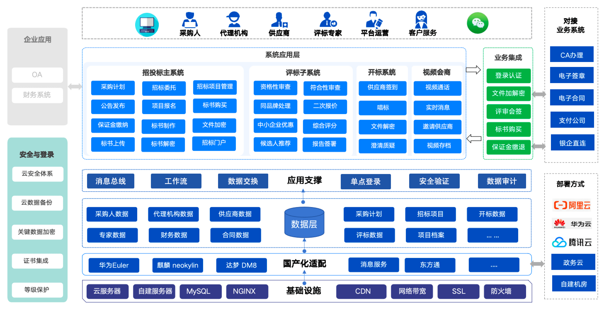
*系统整体架构图*

---

### 四大角色工作台

#### 采购人工作台
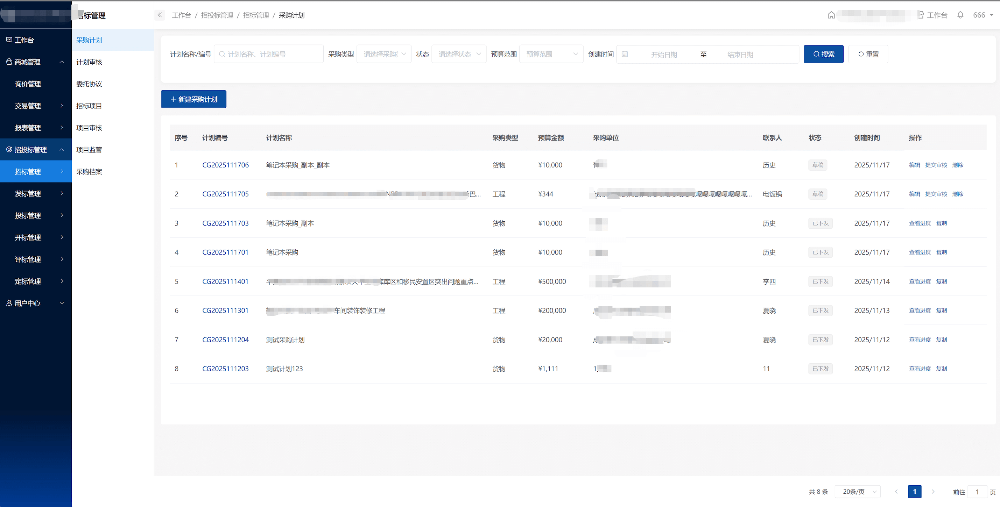
*采购人功能界面 - 采购计划管理、委托协议、结果确认等*

#### 代理机构工作台
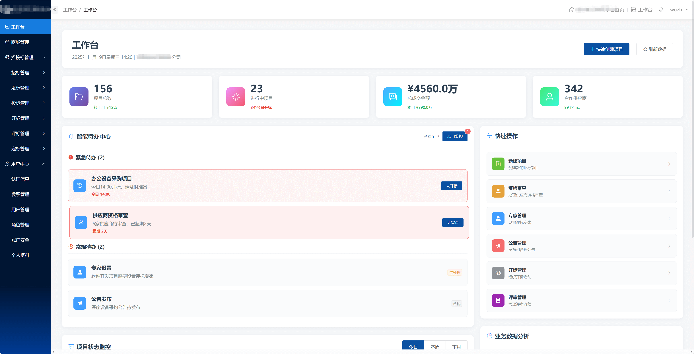
*代理机构功能界面 - 项目管理、公告发布、开标组织等*

#### 供应商工作台
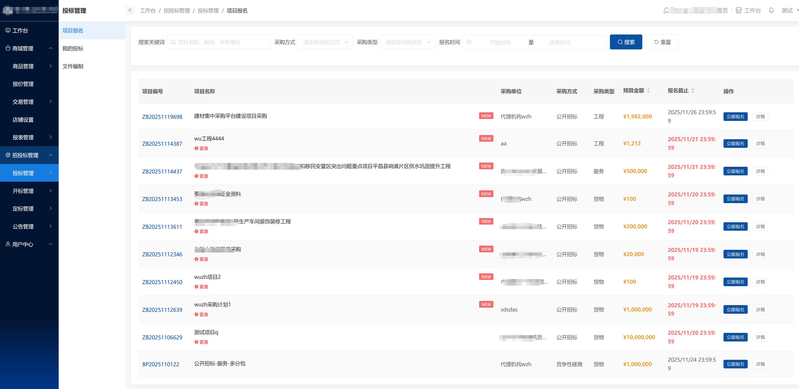
*供应商功能界面 - 项目发现、在线报名、投标文件管理等*

#### 专家工作台
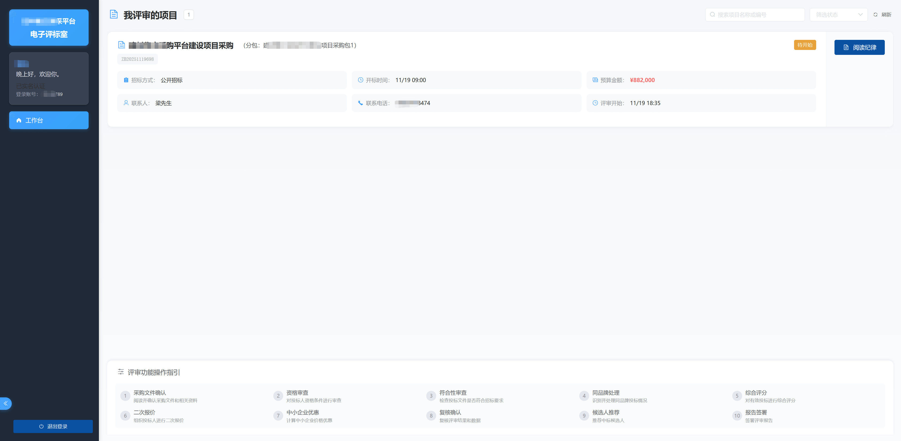
*评审专家功能界面 - 评审组织、专业评审、报告签署等*

---

### 核心业务流程界面

#### 远程开标大厅
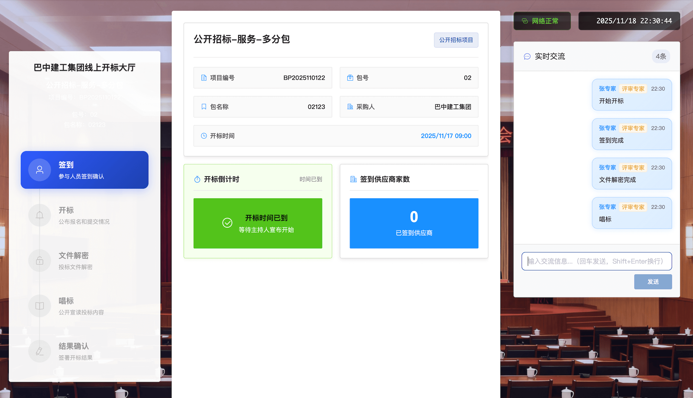
*远程开标界面 - 支持现场、远程、混合三种开标方式*

#### 专家评标界面
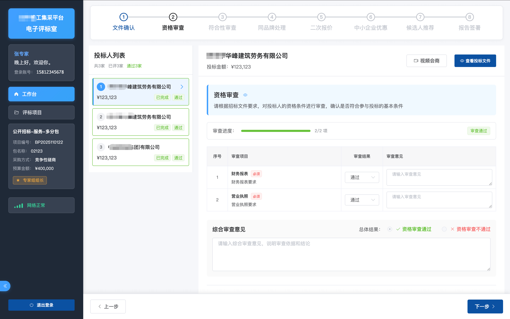
*专家评审界面 - 9个评审阶段完整流程*

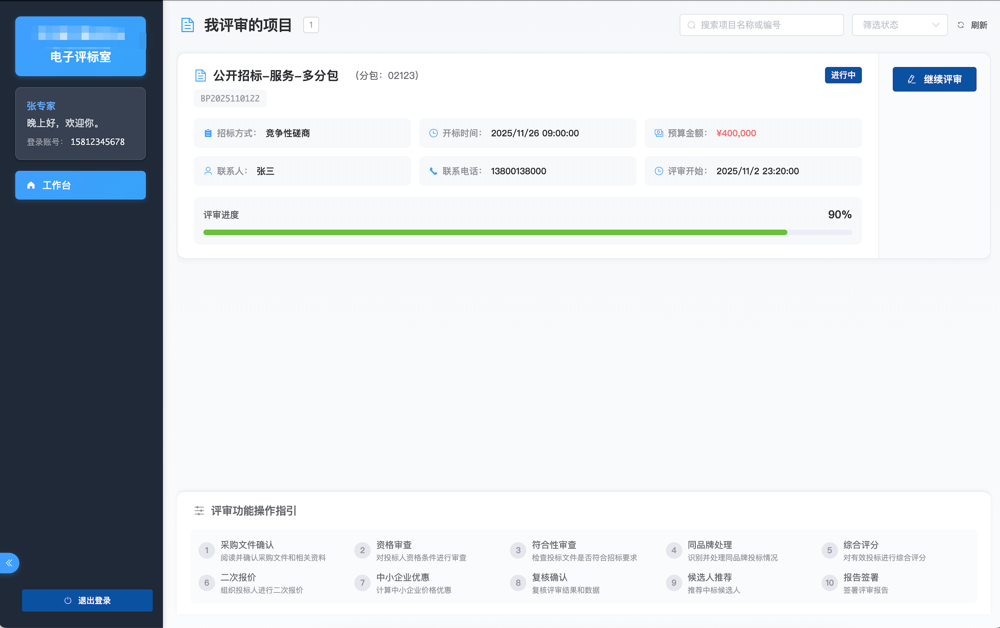
*专家评审界面 - 详细评审功能展示*

---

### 评审标准设置

#### 资格审查标准
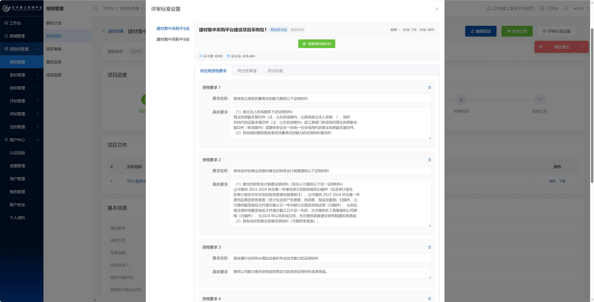
*资格审查标准设置界面*

#### 符合性审查标准

*符合性审查标准设置界面*

#### 评分标准设置
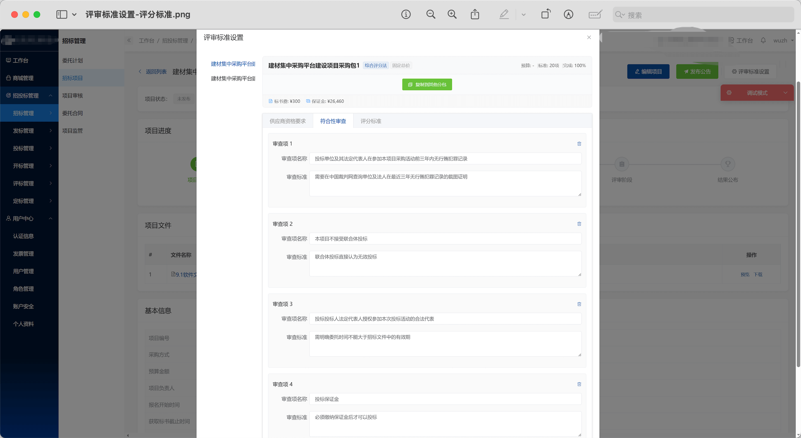
*评分标准设置界面 - 支持综合评分法和最低评标价法*

---

### 供应商投标流程

#### 投标文件编制
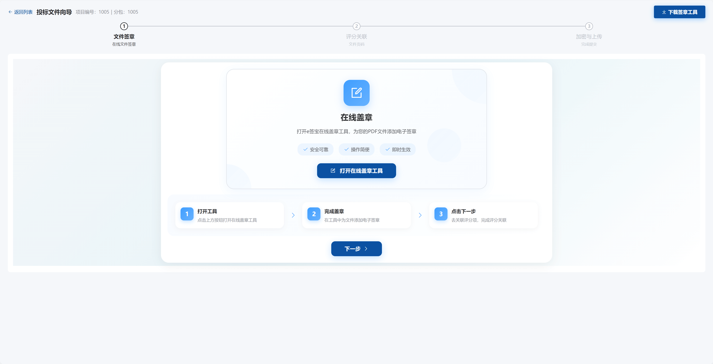
*供应商投标文件编制界面*

#### 文件加密上传
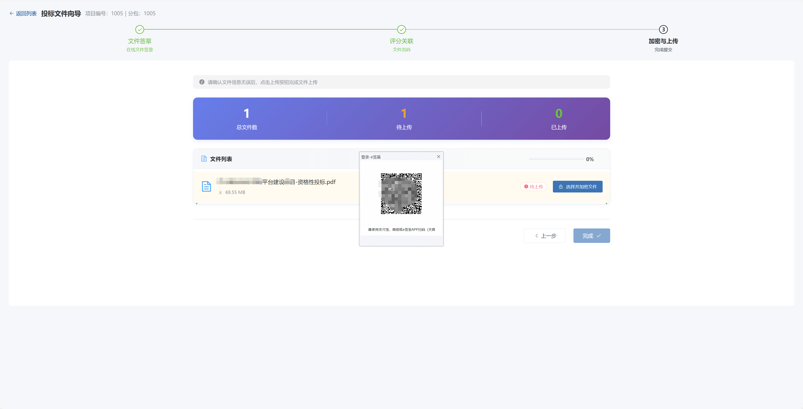
*投标文件加密上传界面 - 确保文件安全*

#### 供应商确认开标结果
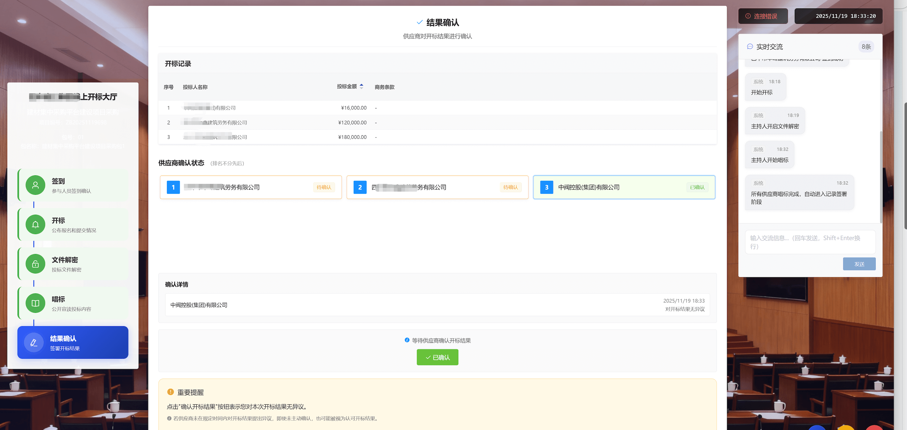
*供应商确认开标结果界面*

---

### 视频会议与报告

#### 视频会商
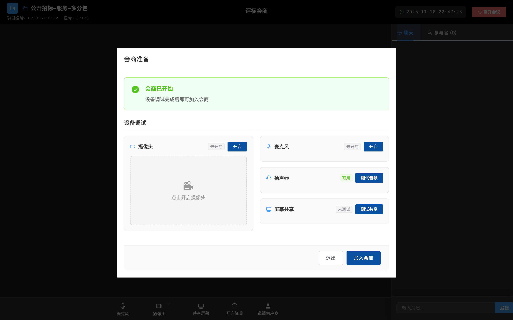
*视频会议界面 - 支持专家远程会商*

#### 候选人推荐报告
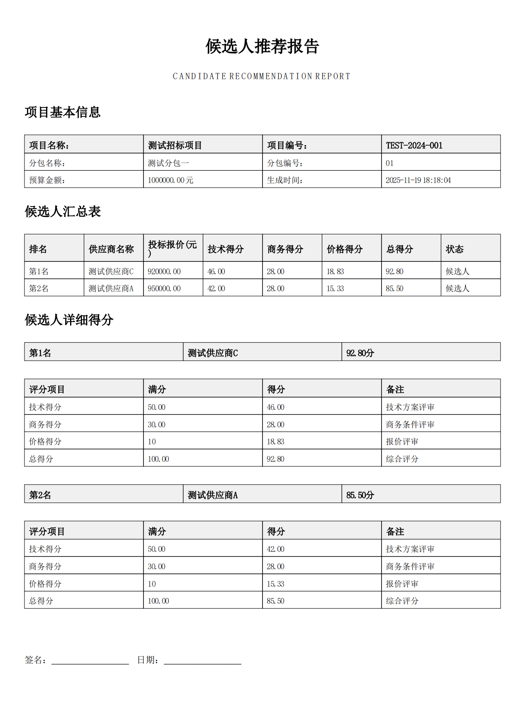
*评审报告界面 - 自动生成评审报告*

---

### 其他功能界面

- **代理机构项目管理**：`ppt/images/代理结构_招标项目.png`、`ppt/images/代理结构_招标项目2.png`
- **资料审核**：`ppt/images/代理结构_资料审核.png`
- **供应商报名审核**：`ppt/images/供应商审核报名资料.png`
- **标书费审核**：`ppt/images/供应商审核购买标书费.png`
- **保证金缴纳**：`ppt/images/供应商缴纳保证金.png`
- **文件解密**：`ppt/images/供应商解密文件页面.png`、`ppt/images/解密文件页面.png`
- **设置评审专家**：`ppt/images/设置评审专家.png`
- **专家推荐组长**：`ppt/images/专家推荐组长.png`
- **专家阅读评审纪律**：`ppt/images/专家阅读评审纪律.png`

更多界面截图请查看 `ppt/images/` 文件夹。

---

## 🏗️ 系统架构

系统采用**前后端分离**架构，后端提供RESTful API，前端通过HTTP/WebSocket与后端通信。系统架构清晰，模块化设计，便于维护和扩展。

**技术栈**：
- **后端**：Spring Boot + Java + MyBatis + MySQL + Redis
- **前端**：Vue.js + Element UI + Vuex
- **基础设施**：CA数字证书服务、音视频服务、文件存储

详细的数据库设计文档请参考：`docs/现有数据库/bidding.sql`

---

## 🚀 快速开始

### 环境要求

- **JDK**：1.8+
- **Maven**：3.6+
- **Node.js**：12+
- **MySQL**：5.7+
- **Redis**：5.0+

### 基本部署步骤

1. **克隆项目**：`git clone <repository-url>`
2. **数据库初始化**：导入 `docs/现有数据库/bidding.sql`
3. **配置数据库**：修改 `bidding/bidding-app-api/src/main/resources/application.yml`
4. **编译后端**：`mvn clean install -DskipTests`
5. **启动后端**：`cd bidding/bidding-app-api && mvn spring-boot:run`
6. **配置前端**：修改 `portal/src/config/dev.env.js`
7. **安装前端依赖**：`cd portal && npm install`
8. **启动前端**：`npm run serve`

详细部署文档请参考项目中的配置文件和相关文档。

---

## 💼 商业价值分析

### 投资回报分析

#### 成本节约
- **人力成本降低60%**：自动化流程减少人工操作
- **差旅成本节约**：远程开评标，无需现场参与
- **纸质文件成本**：全流程无纸化，节约纸张和打印成本
- **时间成本节约**：项目周期缩短50%以上

#### 效率提升
- **项目周期缩短**：从传统30-45天缩短至15-20天
- **响应速度提升**：实时通知和处理，提升响应速度
- **错误率降低**：自动化流程减少人为错误
- **管理效率提升**：统一平台管理，提升管理效率

#### 竞争优势
- **合规性保障**：符合国家招投标法律法规要求
- **透明度提升**：全流程透明，提升公信力
- **覆盖面扩大**：在线平台触达更多供应商
- **服务质量提升**：标准化流程，提升服务质量

### 实施成本

系统提供完整源代码，购买后可直接部署使用：
- **一次性购买**：获得完整源代码和数据库设计
- **技术支持**：提供技术支持和部署指导
- **无年费**：无年度授权费用
- **可定制**：基于源代码可进行二次开发

### 适用场景详细说明

#### 1. 政府采购平台
适用于各级政府机构，支持政府采购全流程管理，符合政府采购法规要求。

#### 2. 企业采购平台
适用于大型企业集团，支持企业内部采购管理，提升采购效率。

#### 3. 工程建设项目招投标
适用于工程建设类项目，支持复杂的多分包项目管理。

#### 4. 货物和服务采购
适用于各类货物和服务采购，支持灵活的评审标准配置。

#### 5. 招标代理机构
适用于专业招标代理机构，支持多项目并行管理，提升业务效率。

---

## 📞 联系方式与购买说明

### 技术支持

购买后提供完整的技术支持服务：
- **部署指导**：提供详细的部署文档和技术支持
- **问题解答**：及时解答技术问题和使用问题
- **功能说明**：详细的功能说明和使用指南

### 商业合作

如有任何问题或需要商业合作，请联系：

- **邮箱**：767086416@qq.com
- **微信**：wzhnbb
- **技术支持**：767086416@qq.com

### 购买说明

- ✅ **完整源代码**：提供完整的源代码和数据库设计
- ✅ **技术支持**：提供技术支持和部署指导
- ✅ **无年费**：一次性购买，无年度授权费用
- ✅ **可定制**：基于源代码可进行二次开发
- ✅ **商业授权**：购买后获得商业使用授权

---

**重要提示**：本项目为商业项目，购买后提供完整源代码和技术支持。请勿用于非法用途。购买前请仔细阅读相关授权协议。
