# 电子招投标系统 · 企业级电子化招标采购平台源码

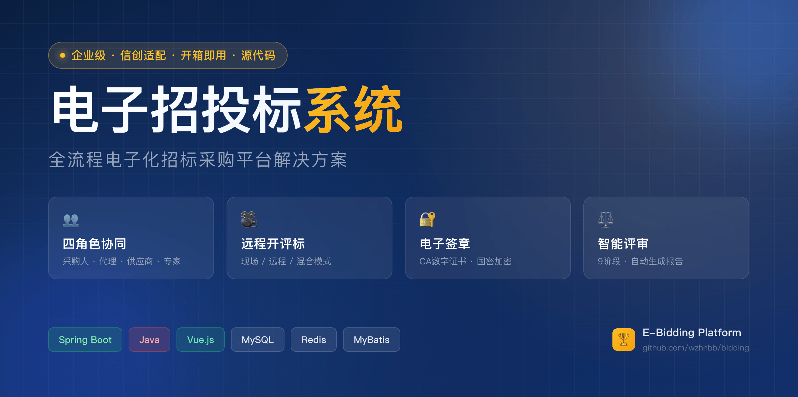

> 基于 **Spring Boot + Vue** 的全流程电子招投标解决方案，为**软件集成商**与**企业 IT 团队**提供开箱即用的招标采购能力。

  
  
  
  
  
  
  

---

## 🎬 在线 Demo · 立即体验

> **🌐 演示地址**：<http://bidding.qa.ecbluestone.cn/>
>
> **无需部署**，直接点开访问，适合快速建立初步印象（系统界面、交互流程、核心功能概览）。

### 想走完整业务流程？申请 4 角色演示账号

体验**发起项目 → 公告发布 → 报名投标 → 开标 → 评审 → 发中标通知**全流程：

| 角色 | 可操作范围 |
|------|-----------|
| 🏛️ **采购人** | 发起采购计划、签署委托协议、确认中标结果 |
| 🏢 **代理机构** | 发布招标公告、组织开标、管理评审专家 |
| 🏬 **供应商** | 在线报名、投标文件加密上传、远程开标参与 |
| 👨‍⚖️ **评审专家** | 9 阶段完整评审、数字签名签署报告 |

**📞 申请方式**：

- 💬 **微信**：`wzhnbb` · 备注 `演示账号+您的单位`，2 小时内响应
- 📮 **邮箱**：<767086416@qq.com>

---

## 🎯 这个系统适合谁

| 👥 目标用户 | 💼 核心价值 |
|----------|----------|
| **软件集成商 / 技术服务公司** | 快速交付政企招投标项目，省下 12+ 个月自研周期 |
| **甲方企业 IT 团队** | 自建采购 / 招标系统，源码级掌控 + 自由二开 |
| **招标代理机构技术负责人** | 自研 vs 采购决策的 baseline 技术参考 |

---

## ⚡ 30 秒速览

- **技术栈**：Spring Boot + MyBatis + MySQL + Redis · Vue.js + Element UI（前后端分离）
- **核心能力**：四角色协同 · 远程开评标 · CA 电子签章 · 9 阶段智能评审 · 信创适配
- **交付形式**：完整源码 + 数据库设计文档 + 部署指导 + 技术答疑
- **适用场景**：政府采购 · 企业采购 · 工程招投标 · 货物服务采购 · 招标代理业务

---

## 📋 核心功能模块

### 1. 采购人（采购单位）

招标采购活动的发起方和需求方：

- **采购计划管理**：创建、编辑、审核采购计划
- **委托协议签署**：委托代理机构执行采购项目
- **采购文件确认**：确认代理机构编制的采购文件
- **采购结果确认**：确认评审结果和中标人
- **项目档案查看**：查看项目全流程档案和文档

### 2. 代理机构

招标采购活动的核心执行者，受采购单位委托负责项目全流程执行：

- **计划受理**：受理采购单位的委托任务
- **项目管理**：创建和管理招标项目，支持多分包项目
- **公告发布**：发布招标公告、更正公告、中标公告等
- **开标组织**：组织现场 / 远程开标，管理开标流程
- **评审管理**：分配评审专家，组织评审活动
- **结果发布**：发布评审结果和中标公示
- **报名审核**：审核供应商报名资格

### 3. 供应商 / 投标人

招标采购活动的参与竞争方：

- **项目发现**：浏览和搜索招标项目
- **项目报名**：在线报名参与投标
- **投标文件管理**：上传和管理投标文件
- **远程开标参与**：参与远程开标，在线签到、唱标、签署
- **远程评标参与**：参与远程评标答疑
- **中标通知书接收**：接收和确认中标通知书

### 4. 评审专家

独立第三方专业评审人员，负责对投标文件进行专业评审：

- **身份认证**：专家身份认证和登录
- **评审组织**：评审组长组织评审流程
- **专业评审**：9 个评审阶段完整评审流程
  - 采购文件确认 · 资格审查 · 符合性审查 · 同品牌处理 · 综合评分
  - 中小企业优惠 · 复核确认 · 候选人推荐 · 报告签署
- **文件分析**：在线查看和分析投标文件
- **报告签署**：数字签名签署评审报告
- **会商主持**：评审组长主持专家会商

---

## 🏗️ 技术架构

**前后端分离** · RESTful API + WebSocket · 模块化设计，便于二次开发与扩展。

### 技术栈明细

| 层级 | 组件 | 版本 |
|------|------|------|
| 后端框架 | Spring Boot | 2.x |
| 数据持久层 | MyBatis | 3.x |
| 主数据库 | MySQL | 5.7+ |
| 缓存 / 会话 | Redis | 5.0+ |
| 前端框架 | Vue.js | 2.x |
| 前端 UI | Element UI | 2.x |
| 前端状态 | Vuex | - |
| 音视频 RTC | 火山引擎 RTC（可替换） | - |
| 电子签章 | CA 数字证书 · 国密算法 | - |
| 构建工具 | Maven · npm | - |

> 部署拓扑图、配置详解、架构设计文档 **联系获取**。

---

## 🔌 集成能力

为甲方 IT 团队与集成商设计，开放标准接入点：

| 集成能力 | 说明 |
|---------|------|
| **OpenAPI / RESTful 接口** | 标准 HTTP JSON 接口，便于对接 OA / ERP / 采购管理系统 |
| **单点登录 (SSO)** | 可对接钉钉 · 企业微信 · OA 主账号体系 |
| **CA 电子签章** | 已支持主流 CA 厂商，具体对接方式按项目定制 |
| **音视频 SDK** | 默认火山引擎 RTC，可切换至腾讯云 · 阿里云 |
| **文件存储** | 本地磁盘 / 阿里云 OSS / MinIO 可配置切换 |
| **消息通知** | 短信 · 邮件 · 微信模板消息 · 企微 / 钉钉机器人 |
| **WebSocket** | 开标、评审等实时事件推送 |

> 完整 API 文档、SDK 接入示例、扩展点说明 **联系获取**。

---

## 🇨🇳 信创适配

基于 Java 技术栈，可为政企客户提供国产化部署能力，兼容主流信创环境：

| 类别 | 兼容环境 |
|------|---------|
| **操作系统** | 统信 UOS · 麒麟 V10 · 中标麒麟 |
| **CPU 架构** | 鲲鹏（ARM64）· 飞腾 · 龙芯 · 海光 |
| **数据库** | 达梦 DM8 · 人大金仓 KingbaseES |
| **中间件** | 东方通 TongWeb · 宝兰德 BES |
| **浏览器** | 奇安信浏览器 · 360 安全浏览器 · Chrome · Edge |

> 信创环境部署按项目需求进行适配验证。**信创适配部署方案** 联系获取。

---

## 📊 产品能力概览

- **业务覆盖**：从采购计划 → 公告 → 报名 → 投标 → 开标 → 评审 → 中标 → 归档全流程
- **评审流程**：9 阶段完整评审（资格审查、符合性审查、同品牌处理、综合评分、复核确认等）
- **开评标方式**：现场 · 远程 · 混合三种模式自由切换
- **音视频会商**：单次评审支持 20+ 专家在线会商，含屏幕共享
- **界面截图**：仓库 `ppt/images/` 提供 20+ 核心界面截图
- **功能清单**：`doc/招投标系统功能.xlsx` 提供完整功能清单

> 代码规模报告、数据模型 ER 图、完整技术白皮书 **联系获取**。

---

## 📸 系统界面展示

### 系统架构

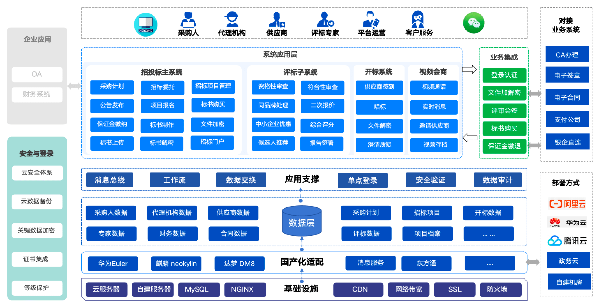

### 四大角色工作台

| 采购人工作台 | 代理机构工作台 |
|:---:|:---:|
| 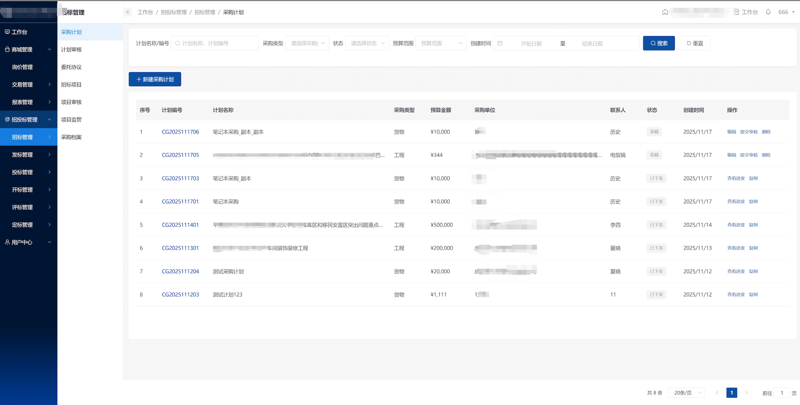 | 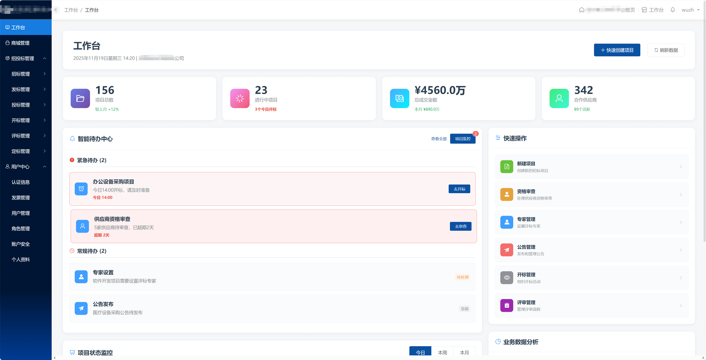 |
| 采购计划、委托协议、结果确认 | 项目管理、公告发布、开标组织 |

| 供应商工作台 | 评审专家工作台 |
|:---:|:---:|
| 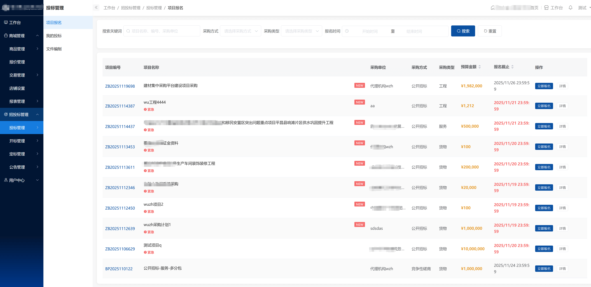 | 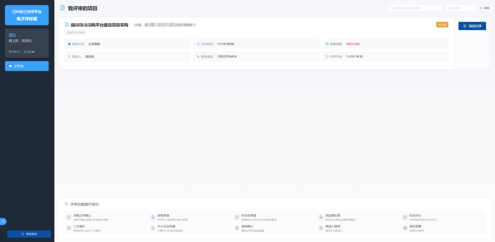 |
| 项目发现、报名、投标文件管理 | 评审组织、专业评审、报告签署 |

### 核心业务流程

**远程开标大厅**（支持现场 / 远程 / 混合三种模式）

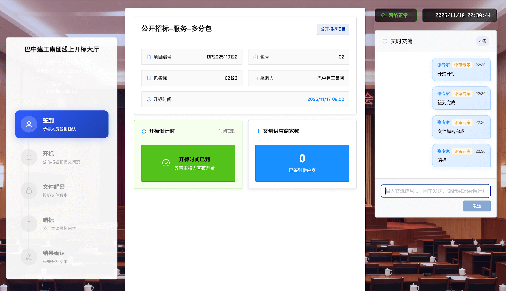

**专家评标界面**（9 阶段完整评审流程）

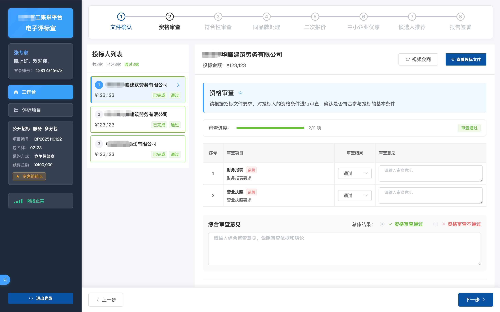

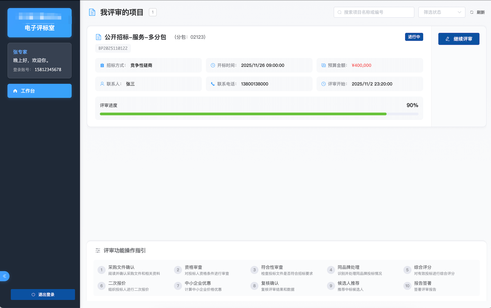

### 评审标准设置

| 资格审查 | 符合性审查 | 评分标准 |
|:---:|:---:|:---:|
| 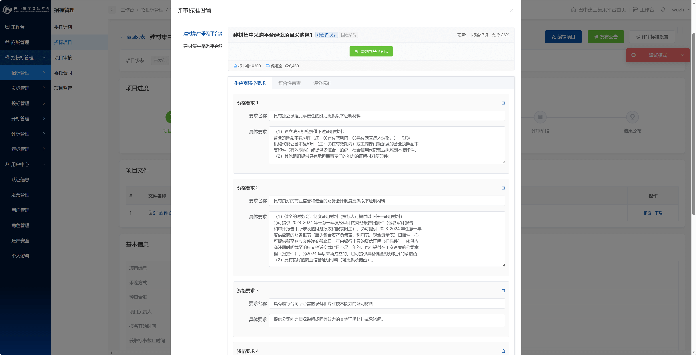 |  | 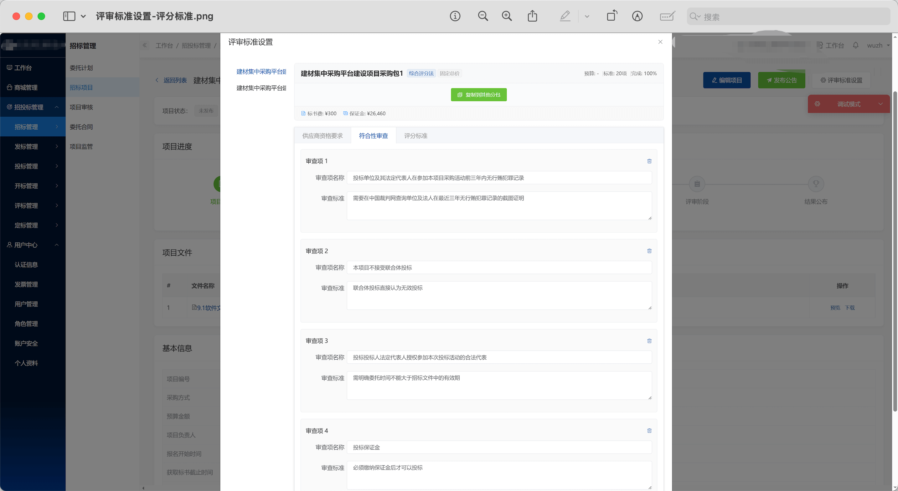 |

### 供应商投标流程

| 投标文件编制 | 文件加密上传 | 确认开标结果 |
|:---:|:---:|:---:|
| 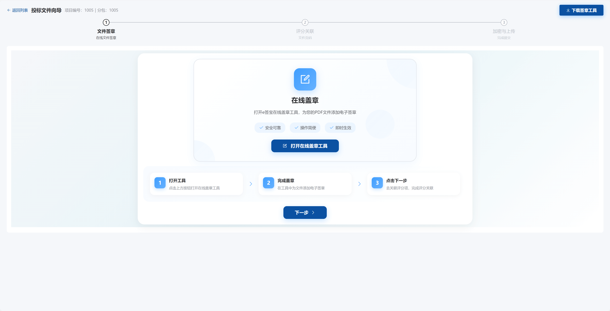 | 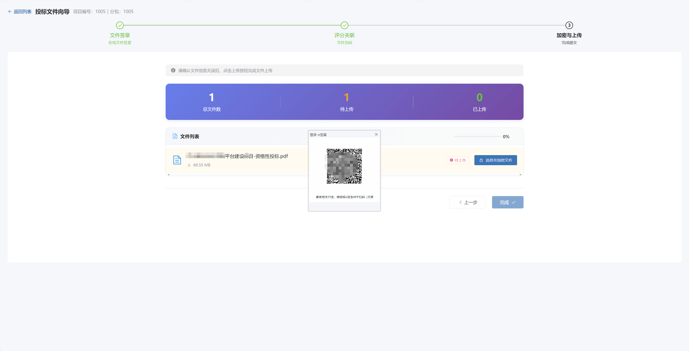 | 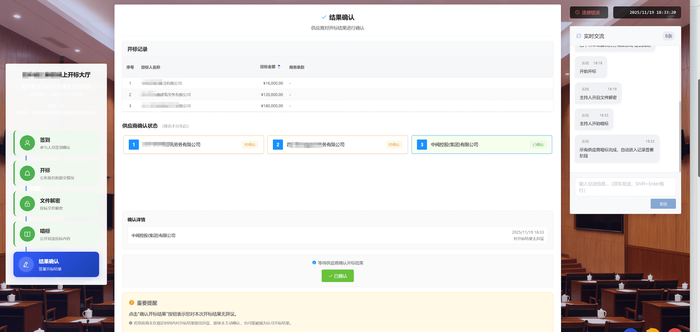 |

### 视频会议与报告

| 视频会商 | 候选人推荐报告 |
|:---:|:---:|
| 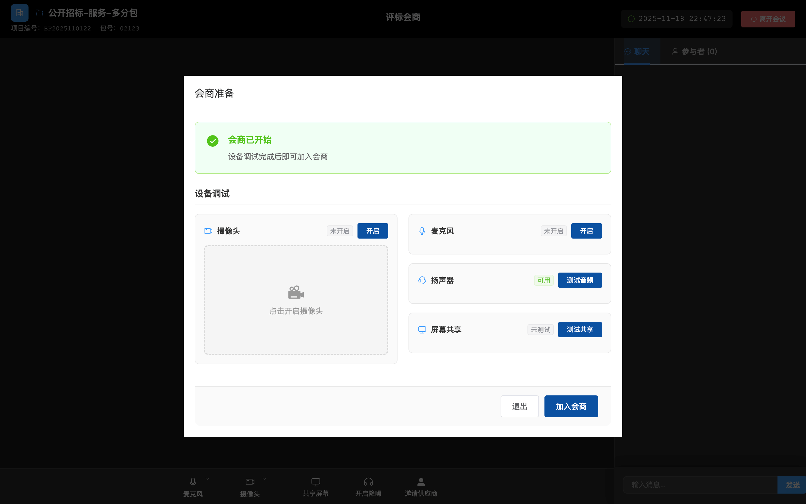 | 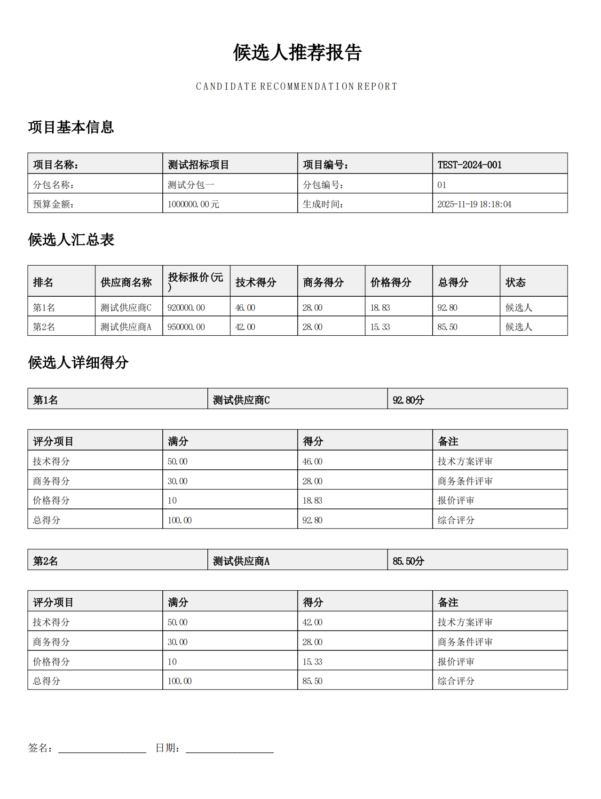 |

> 更多界面截图请查看 `ppt/images/` 目录，或访问[在线 Demo](http://bidding.qa.ecbluestone.cn/) 直接体验。

---

## 🚀 快速部署

### 环境要求

| 组件 | 版本 | 说明 |
|------|------|------|
| JDK | 1.8+ | OpenJDK / 毕昇 JDK 均可 |
| Maven | 3.6+ | 后端构建 |
| Node.js | 12+ | 前端构建 |
| MySQL | 5.7+ | 或达梦 DM8 · 人大金仓 KingbaseES |
| Redis | 5.0+ | 缓存 / 会话 |

### 部署步骤（概览）

1. 获取源码与数据库 SQL 文件（通过商务合作）
2. 导入数据库 DDL 与初始化数据
3. 配置 `application.yml`（数据库、Redis、CA 证书、音视频参数）
4. 后端构建：`mvn clean install -DskipTests`
5. 后端启动：`mvn spring-boot:run`（或打 jar 包运行）
6. 前端构建：`npm install && npm run build`
7. 前端部署：静态资源部署至 Nginx 或对象存储

> **完整部署文档**（含信创环境部署、Docker Compose 容器化部署、常见问题排查）**联系获取**。

---

## 🤝 合作模式

提供三种合作方式，按实际需求选择：

| 模式 | 适合谁 | 交付内容 |
|------|--------|---------|
| **源码授权** | 有二开能力的软件公司 / 甲方 IT 团队 | 完整源码 + 数据库设计 + 部署指导 + 技术答疑 |
| **定制开发** | 有个性化需求 / 特定行业场景 | 基于现有系统按需定制开发 |
| **技术咨询** | 自研评估期的技术团队 | 方案评审 / 架构咨询 / 踩坑经验分享 |

**授权特点**：

- ✅ 一次性授权，**无年费**
- ✅ 源码完全开放，无代码混淆，可自由二次开发
- ✅ 提供完整数据库设计 + 部署指导
- ✅ 持续的技术答疑支持

具体报价根据合作模式与定制需求确定，欢迎联系沟通。

---

## 📚 技术资源 · 免费领取

为帮助完成技术评估，我们提供以下资料，**联系即可免费获取**：

- 📦 **完整部署指导文档**（PDF）
- 🎯 **4 角色演示账号**（走完业务全流程）
- 📊 **招投标系统选型白皮书**（自研 vs 采购对比）
- 🏗️ **数据库 DDL + ER 图**
- 🇨🇳 **信创适配部署方案**
- 🔌 **API 集成示例与扩展点说明**
- 📋 **完整功能清单 Excel**

**领取方式**：加微信 `wzhnbb`，备注所需资料名称，即时发送。

---

## ❓ 常见问题 FAQ

<b>Q1：是否提供完整源代码？</b>

是。源码授权模式下提供前端 + 后端 + 数据库设计的完整代码，**无代码混淆或加密**，可自由二次开发。

<b>Q2：授权价格区间？</b>

价格根据合作模式（源码授权 / 定制开发 / 技术咨询）及是否需要定制开发有所不同。请联系沟通具体需求后提供报价。

<b>Q3：支持信创环境部署吗？</b>

支持。系统基于 Java 技术栈，可兼容麒麟 / 统信 UOS、鲲鹏 / 飞腾 CPU、达梦 / 人大金仓数据库等主流信创环境。具体适配方案按项目需求定制验证。

<b>Q4：二次开发难度如何？</b>

系统采用标准 Spring Boot + Vue 前后端分离架构，模块化设计清晰。熟悉 Java / Vue 的开发团队可快速上手。交付时提供代码结构讲解和技术答疑。

<b>Q5：部署周期多久？</b>

- **标准环境部署**：1-2 周（含环境搭建、配置调整、基础测试）
- **信创环境部署**：2-4 周（含数据库迁移、中间件适配、兼容性测试）
- **定制开发**：视需求范围，通常 1-3 个月

<b>Q6：能对接我们现有的 OA / ERP / CA 系统吗？</b>

可以。系统提供完整 RESTful API 和 SSO 对接能力，支持对接钉钉、企业微信、OA 系统、ERP 系统以及主流 CA 厂商。具体对接方案在需求沟通阶段确定。

<b>Q7：有没有售后和长期运维支持？</b>

提供部署指导、上线答疑、Bug 修复协助。长期运维支持可通过"定制开发"或"技术顾问"合作模式提供。

<b>Q8：Demo 账号能用多久？</b>

演示账号长期有效，可反复体验。数据为测试数据，不影响真实业务。

<b>Q9：和 C 端商业产品（SaaS）有什么区别？</b>

本项目为**源码交付型**解决方案，不是 SaaS 产品。适合需要私有化部署、源码掌控、二次开发的政企客户或软件集成商。

---

## 📞 联系我们

| 渠道 | 信息 |
|------|------|
| 💬 **微信** | `wzhnbb` |
| 📮 **邮箱** | <767086416@qq.com> |
| 🎬 **在线 Demo** | <http://bidding.qa.ecbluestone.cn/> |

**欢迎技术交流与合作咨询**。无论是评估方案、咨询定制需求，还是只想先看 Demo 和资料，都可以直接联系。

> 添加微信时请简短备注来意（如 `演示账号`、`源码咨询`、`技术交流`），便于高效响应。

---

> **声明**：本项目为商业软件，完整源代码与技术支持通过商务合作方式提供。请勿用于非法用途。合作细节以双方签订协议为准。
